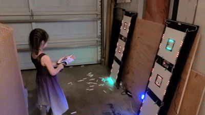

# FoamTargets

This project contains software to drive electronic foam-dart targets that detect hits with MPU6050 accelerometers, react with RGB LED strip lights, and communicate with other targets to coordinate games.

